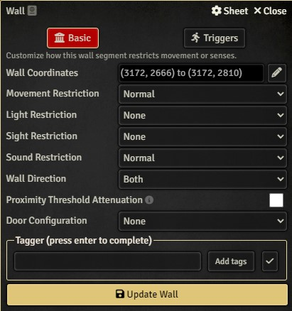
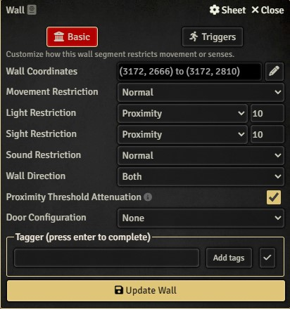
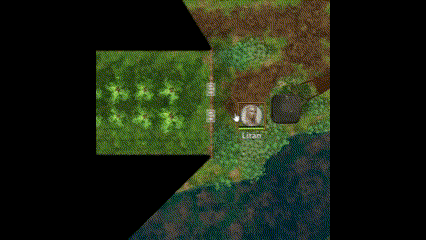

# Dungeon Alchemist Post Processor

This is a NodeJS project for processing Foundry exports from [Dungeon Alchemist](https://store.steampowered.com/app/1588530/Dungeon_Alchemist/). See the [Foundry article on Walls](https://foundryvtt.com/article/walls/) for more information about Wall configuration.

There are probably a number of use cases this logic does not correctly identify.
Sample submissions are welcome and I will do my best to refine the logic. Please
double-check your wall configuration after importing.

## What does it do?

**Note:** The following animations were captured with [Token Vision enabled for the scene (see Lighting Settings)](https://foundryvtt.com/article/scenes/)
using the [Pathfinder 2e](https://foundryvtt.com/packages/pf2e/) system with Rules-Based Vision enabled.

### Windows

Windows are set with Light and Sight Restriction set to Proximity with a default
distance of 10 feet, and Proximity Threshold Attenuation is enabled. Windows are detected
as being less than 2 grid squares, having no sense restrictions. To change the sight
distance to something other than 10 feet, edit WindowTransformer.

This will limit token vision through windows on either side until the token is within
the proximity distance.

---

<div style="display: flex; flex-direction: row; gap: 20px; align-items: center;">
  <div style="font-weight: bold;">Window - Before: Token can see an unlimited distance through any number of windows</div>
  <br>
  
  
</div>
<hr>
<div style="display: flex; flex-direction: row; gap: 20px; align-items: center;">
  <div style="font-weight: bold;">Window - After: Token can only see through a window as they approach the proximity threshold</div>
  <br>
  
  
</div>

---

### Fences

Fences are set with Light and Sight Restriction set to Limited instead of None, and Sound
Restriction set to None instead of Normal. Fences are detected as being greater than 2
grid squares, having no sense restrictions. A fence that is exactly 1 or 2 grid squares
may erroneously be detected as a window, though we will attempt to correct that by
converting any "window" attached only to fences into a fence itself.

This will permit token vision through the fence, but obscure vision through multiple
fences.

---

<div style="display: flex; flex-direction: row; gap: 20px; align-items: center;">
  <div style="font-weight: bold;">Fence - Before: Token can see through any number of consecutive fences</div>
  <br>
  
  
</div>
<hr>
<div style="display: flex; flex-direction: row; gap: 20px; align-items: center;">
  <div style="font-weight: bold;">Fence - After: Token can only see through the closest fence</div>
  <br>
  
  
</div>

---

### Gates

Gates are set with Light and Sight Restriction set to Limited instead of None, and Sound
Restriction set to None instead of Normal. Gates are detected as being less than 2 grid
squares and attached to a known Fence. A Gate that is attached to a Fence that is
mistaken for a Window will not be updated.

This will permit vision through the gate, much as with a fence. The default in the
DA export is that a gate is treated as opaque to the tokens, as with a standard door.

---

<div style="display: flex; flex-direction: row; gap: 20px; align-items: center;">
  <div style="font-weight: bold;">Gate - Before: Token cannot see through the gate</div>
  <br>
  
  
</div>
<hr>
<div style="display: flex; flex-direction: row; gap: 20px; align-items: center;">
  <div style="font-weight: bold;">Gate - After: Token can see through the nearest gate</div>
  <br>
  
  
</div>

---

## Getting Started

### Prerequisites

- Node.js (v22 or later)
- npm (v10 or later)

### Installation

1. Clone the repository:

```sh
git clone https://github.com/yourusername/dungeon-alchemist-post-processor.git
```

2. Navigate to the project directory:

```sh
cd dungeon-alchemist-post-processor
```

3. Install the dependencies:

```sh
npm install
```

### Implementation

The specifics for how objects are detected are documented in the various Filter classes. Note
that the results can be imprecise due to the limitations of the source data. Assumptions are
made that windows and doors cannot be more than two grid units wide. However, the cleanup
should be considerably less effort than updating everything by hand every time the Dungeon
Alchemist JSON is imported.

### Inference Rules

Since everything is just a "wall", we have to infer what the configuration should be from the
exported settings. In the DA export:

- Fences and windows both block movement and sound, but not sense, and are not doors (making fences and windows identical)
- Gates block movement, sound, and sense, and are doors (making them identical to actual doors)

We can apply the following rules to attempt to infer the original type of a wall:

- A window can be no more than two grid units in length
- A window cannot block sense  

- A fence can be any number of grid units in length
- A fence cannot block sense
- A window that is attached to fence segments at both ends is likely a misidentified fence  

- A gate can be no more than two grid units in length
- A gate can only be attached to a fence or another gate

### Usage

To run the transformation, use the following command:

```sh
npm start process {Foundry JSON file exported from Dungeon Alchemist}
```

The output will look something like the following:

```
File content successfully read into memory
Grid size: 72
Processing JSON data on Windows
Updating detected window at coordinates: 1872,860,1728,860
...
23 windows processed
Processing JSON data on Fences
Updating detected fence at coordinates: 1728,3458,141,3458
...
12 fences processed
Processing JSON data on Gates
12 fences found
Updating detected gate at coordinates: 1728,2953,1728,2881
...
3 gates processed
Modified JSON data written to C:\Users\sferg\Desktop\dungeon-alchemist-post-processor\output.json
```

### Contributing

Contributions are welcome! Please fork the repository and create a pull request.

### License

This project is licensed under the MIT License.

### Contact

For any questions or feedback, please contact [sfergus1@gmail.com](mailto:sfergus1@gmail.com).
